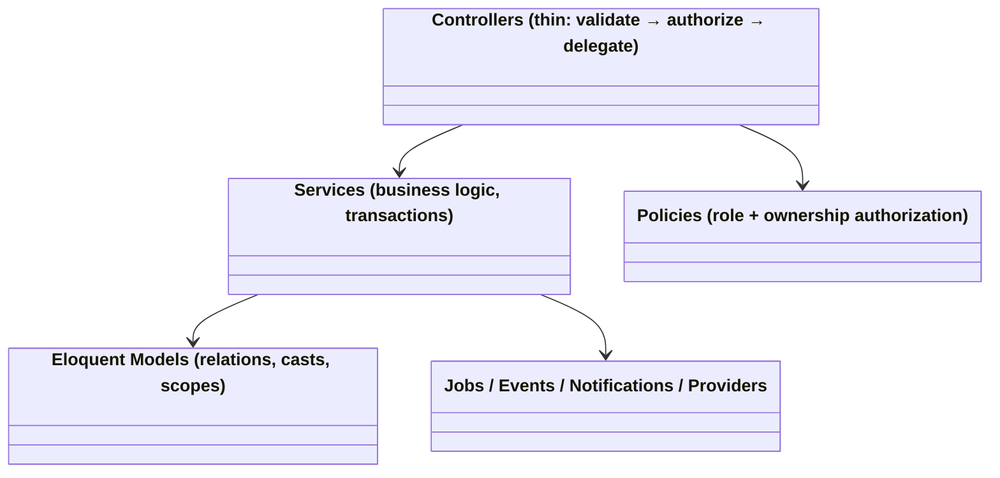
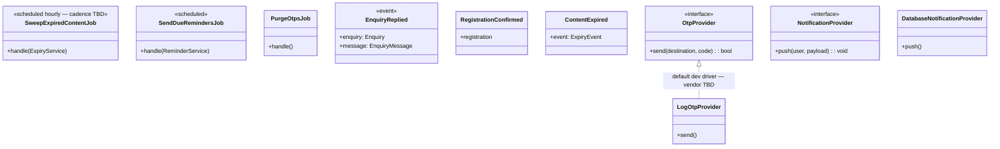

# Class Diagram — SportX India (Backend)

Backend class/model structure for the **Laravel** application: Eloquent models, controllers, services, jobs, policies, events, and providers. Layer responsibilities are defined in `Backend-Architecture.md`.

> **Conventions:** Models = Eloquent entities from `ER-Diagram.md`. Controllers grouped per API module (route prefixes per `API-Specification.md`). Services hold business logic; controllers stay thin; policies hold authorization. `<<morph>>` notes polymorphic relations.

---

## 1. High-Level Layer Diagram



---

## 2. Domain Models

```mermaid
classDiagram
    class User {
        +role: RoleEnum
        +name: string
        +email: string
        +phone: ?string
        +status: UserStatus
        +athleteProfile() HasOne
        +coachProfile() HasOne
        +academies() HasMany
        +organizerProfile() HasOne
        +sponsorProfile() HasOne
        +adminProfile() HasOne
        +savedItems() HasMany
        +notifications() HasMany
    }

    class OtpCode {
        +channel: OtpChannel
        +destination: string
        +code_hash: string
        +expires_at: Carbon
        +consumed_at: ?Carbon
        +isValid(code): bool
    }

    class AthleteProfile {
        +skill_level: SkillLevel
        +user() BelongsTo
        +ageGroup() BelongsTo
        +city() BelongsTo
        +sports() BelongsToMany
        +achievements() HasMany
        +media() MorphMany
        +trialRegistrations() HasMany
        +tournamentRegistrations() HasMany
        +sponsorshipApplications() HasMany
    }

    class Achievement {
        +text: string
        +sort_order: int
    }

    class MediaItem {
        <<polymorphic owner>>
        +media_type: MediaType
        +path: string
        +sort_order: int
        +owner() MorphTo
    }

    class CoachProfile {
        +full_name: string
        +sport_id: FK
        +contact_number: string
        +experience: string
        +qualification: ?string
        +certifications: array
        +academy_id: FK ?Academy
        +languages: array
        +email: ?string
        +personal_coaching: bool
        +fee_structure: string
        +bio: ?string
        +city_id: FK
        +photo_media_id: FK ?MediaItem
        +listing_status: ListingStatus
        +profile_completeness: int
        +sports() BelongsToMany
        +enquiries() MorphMany
        +computeCompleteness(): int
    }

    class Academy {
        +name: string
        +description: text "■ Mandatory"
        +address: string "■ Mandatory"
        +contact_number: string "■ Mandatory"
        +google_maps_url: string "■ Mandatory"
        +facilities: array
        +fee_range: string
        +timings: string
        +age_groups: array
        +year_established: ?int
        +achievements: array
        +email: ?string
        +website: ?string
        +head_coach_id: FK ?User
        +logo_media_id: FK ?MediaItem
        +cover_media_id: FK ?MediaItem
        +verification_badge: bool
        +listing_status: ListingStatus
        +owner() BelongsTo~User~
        +sports() BelongsToMany
        +coaches() HasMany~AcademyCoach~
        +trials() HasMany
        +enquiries() MorphMany
        +photos() MorphMany~MediaItem~
    }

    class     class SportsVenue {
        +name: string "■ Mandatory"
        +sport_id: FK~Sport
        +address: string "■ Mandatory"
        +google_maps_url: string "■ Mandatory"
        +contact_number: string "■ Mandatory"
        +city_id: FK~City
        +photos: array "Optional"
        +booking_available: bool "Optional"
        +pricing: string "Optional"
        +facilities: array "Optional"
        +working_hours: string "Optional"
        +listing_status: ListingStatus
        +sport() BelongsTo
    }

    OrganizerProfile {
        +organization_name: string
        +org_type: OrgType
        +verification_status: VerificationStatus
        +verificationDocs() MorphMany~MediaItem~
    }

    class SponsorProfile {
        +brand_name: string
        +category: string
        +verification_status: VerificationStatus
        +sponsorships() HasMany
        +shortlistEntries() HasMany
    }

    class Trial {
        +name: string
        +event_datetime: Carbon
        +eligibility: string
        +entry_fee: string
        +required_documents: array
        +status: ListingStatus
        +expires_at: ?Carbon
        +postedBy() BelongsTo~User~
        +academy() BelongsTo ?Academy
        +sport() BelongsTo
        +registrations() HasMany
        +scopePublished(Builder)
        +scopeClosingSoon(Builder, days)
        +isRegisterable(): bool
    }

    class TrialRegistration {
        +registration_ref: string
        +document_status: DocumentStatus
        +verification_status: VerificationStatus
        +reminder_enabled: bool
        +documents() HasMany~TrialRegistrationDocument~
    }

    class Tournament {
        +format: string
        +start_date: ?Carbon
        +end_date: ?Carbon
        +prize_pool: string
        +status: ListingStatus
        +organizer() BelongsTo~OrganizerProfile~
        +categories() HasMany~TournamentCategory~
        +registrations() HasMany
        +results() HasMany~TournamentResult~
    }

    class TournamentCategory {
        +capacity: int
        +waitlist_enabled: bool
        +filledCount(): int
        +hasSpots(): bool
    }

    class TournamentRegistration {
        +participation_type: ParticipationType
        +team_name: ?string
        +payment_status: ManualPaymentStatus
        +status: RegistrationStatus
    }

    class TournamentResult {
        +place: int
        +winner_name: string
        +bracket() BelongsTo ?MediaItem
        +scopePublished(Builder)
    }

    class Scholarship {
        +provider_name: string
        +amount: ?float
        +deadline: ?Carbon
        +external_link: string
        +status: ListingStatus
    }

    class Sponsorship {
        +title: string
        +eligibility_criteria: string
        +benefits_offered: string
        +deadline: ?Carbon
        +sponsor() BelongsTo~SponsorProfile~
        +applications() HasMany
    }

    class SponsorshipApplication {
        +pitch_note: string
        +status: ApplicationStatus
        +athlete() BelongsTo~AthleteProfile~
    }

    class ShortlistEntry {
        +note: ?string
        +athlete() BelongsTo~AthleteProfile~
    }

    class Enquiry {
        <<morph subject: CoachProfile | Academy | SponsorshipApplication>>
        +preferred_datetime: ?Carbon
        +athlete() BelongsTo~AthleteProfile~
        +subject() MorphTo
        +messages() HasMany~EnquiryMessage~
        +latestMessage() HasOne
    }

    class EnquiryMessage {
        +body: string
        +read_at: ?Carbon
        +sender() BelongsTo~User~
    }

    class SavedItem {
        <<polymorphic item>>
        +item() MorphTo
    }

    class ListingReport {
        <<polymorphic reportable>>
        +reason: ReportReason
        +status: ReportStatus
        +reportable() MorphTo
        +resolvedBy() BelongsTo ?User
    }

    class Notification {
        <<polymorphic notifiable>>
        +type: NotificationType
        +read_at: ?Carbon
    }

    class ExpiryRule {
        +content_type: ContentType
        +trigger_field: TriggerField
        +days_after: int
        +is_active: bool
    }

    class ExpiryEvent {
        +status: ExpiryStatus
        +scheduled_at: Carbon
        +content_type: ContentType
        +content_id: int
    }

    class ReminderSubscription {
        <<polymorphic reminderable>>
        +remind_at: Carbon
        +sent_at: ?Carbon
    }

    class Sport { +name: string +is_active: bool }
    class City { +name: string +state: string }
    class AgeGroup { +name: string +min_age: ?int +max_age: ?int }

    User "1" --> "0..1" AthleteProfile
    User "1" --> "0..1" CoachProfile
    User "1" --> "0..*" Academy
    User "1" --> "0..1" OrganizerProfile
    User "1" --> "0..1" SponsorProfile
    AthleteProfile "1" --> "*" Achievement
    AthleteProfile "1" --> "*" TrialRegistration
    AthleteProfile "1" --> "*" TournamentRegistration
    AthleteProfile "1" --> "*" SponsorshipApplication
    Academy "1" --> "*" Trial
    Trial "1" --> "*" TrialRegistration
    Tournament "1" --> "*" TournamentCategory
    Tournament "1" --> "*" TournamentRegistration
    Tournament "1" --> "*" TournamentResult
    Sport "1" --> "*" SportsVenue
    Sponsorship "1" --> "*" SponsorshipApplication
    Enquiry "1" --> "*" EnquiryMessage
```

---

## 3. Controllers (API, grouped by module)

```mermaid
classDiagram
    class AuthController {
        +register(RegisterRequest)
        +verifyOtp(VerifyOtpRequest)
        +resendOtp(ResendOtpRequest)
        +login(LoginRequest)
        +logout()
        +googleRedirect()
        +googleCallback()
    }
    class OnboardingController {
        +show(role)
        +storeAthlete(AthleteOnboardingRequest)
        +storeCoach(CoachOnboardingRequest)
        +storeAcademy(AcademyOnboardingRequest)
        +storeOrganizer(OrganizerOnboardingRequest)
        +storeSponsor(SponsorOnboardingRequest)
    }
    class ProfileController {
        +showAthlete(id)
        +updateAthlete(UpdateAthleteRequest)
        +uploadMedia(UploadMediaRequest)
        +reorderMedia(ReorderRequest)
    }
    class DirectoryController {
        +academies(FilterRequest)
        +coaches(FilterRequest)
        +trials(FilterRequest)
        +tournaments(FilterRequest)
        +scholarships(FilterRequest)
        +sponsorships(FilterRequest)
    }
    class SearchController {
        +suggest()
        +results(SearchRequest)
    }
    class EnquiryController {
        +store(StoreEnquiryRequest)
        +inbox()
        +show(id)
        +reply(ReplyRequest, id)
    }
    class RegistrationController {
        +registerTrial(StoreTrialRegistrationRequest, trial)
        +registerTournament(StoreTournamentRegistrationRequest, tournament)
        +myActivity()
    }
    class SponsorEngagementController {
        +apply(StorePitchRequest, sponsorship)
        +applicationsInbox()
        +decideApplication(DecisionRequest, application)
        +shortlistIndex()
        +shortlistStore(ShortlistRequest)
        +shortlistUpdate(ShortlistRequest, entry)
    }
    class ProviderTrialController {
        +index() store(StoreTrialRequest) update(UpdateTrialRequest, trial) close(trial)
    }
    class ProviderTournamentController {
        +index() store(StoreTournamentRequest) update(...) close(...)
    }
    class RegistrantController {
        +trialRegistrants(trial)
        +verifyRegistrant(registration)
        +rejectRegistrant(registration)
        +tournamentRegistrations(tournament)
        +setPaymentStatus(registration, SetPaymentRequest)
    }
    class CapacityController {
        +show(tournament) +update(UpdateCapacityRequest, tournament)
    }
    class ResultsController {
        +edit(tournament) +publish(PublishResultsRequest, tournament) +showPublic(tournament)
    }
    class SavedItemController { +index() +store() +destroy() }
    class ReportController { +store(StoreReportRequest) }
    class NotificationController { +index() +markRead(id) +markAllRead() }
    class SettingsController { +show() +update(UpdateSettingsRequest) +deleteAccount() }

    class AdminAuthController { +login() +verifyTwoFactor() }
    class AdminDashboardController { +index() }
    class AdminContentController {
        +categories() +list(category, FilterRequest)
        +create(category, StoreContentRequest)
        +update(category, id) +destroy(category, id)
    }
    class AdminModerationController {
        +queue() +show(report) +approve(report) +editAndResolve(report) +remove(report) +warnOwner(report)
    }
    class AdminExpiryController {
        +rulesShow() +rulesUpdate(RulesRequest)
        +monitor(status) +overrideEvent(event) +restoreEvent(event)
    }
    class AdminCategoryController { +crud Sports +crud Cities +crud AgeGroups }
```



---

## 4. Services

```mermaid
classDiagram
    class AuthService {
        +register(dto): User
        +requestOtp(user, channel)
        +verifyOtp(user, code): Token
        +login(identifier, passwordOrOtp): Token
    }
    class OtpService {
        -provider: OtpProvider
        +issue(user, channel, destination): void
        +verify(user, code): bool
    }
    class ProfileService {
        +completeness(coach): int
        +syncSports(profile, sportIds)
        +attachMedia(owner, file, type)
    }
    class SearchService {
        +unified(query, filters): CategoryBuckets
        +perCategory(category, query, filters, page)
    }
    class FilterService {
        +applyToAcademies(q, filters)
        +applyToTrials(q, filters) +...()
    }
    class EnquiryService {
        +openThread(athlete, subject, message, preferredAt): Enquiry
        +reply(enquiry, sender, body): EnquiryMessage
    }
    class RegistrationService {
        +registerForTrial(athlete, trial, payload): TrialRegistration
        +registerForTournament(athlete, category, payload): TournamentRegistration
        -assertTrialOpen(trial)
        -assertCapacity(category): RegistrationStatus
    }
    class SponsorshipService {
        +apply(athlete, sponsorship, pitch): Application
        +decide(application, decision): void
        +shortlist(sponsor, athlete, note): ShortlistEntry
    }
    class ExpiryService {
        -rules: ExpiryRuleRepository
        +scheduleFor(content): ExpiryEvent
        +sweep(): int
        +override(event, admin)
        +restore(event, admin)
    }
    class ReminderService {
        +scheduleFor(user, content): void
        +dispatchDue(): int
        -computeRemindAt(content): Carbon
    }
    class ModerationService {
        +approve(report) +remove(report) +warnOwner(report)
    }
    class NotificationService {
        -driver: NotificationProvider
        +send(user, NotificationDto)
        +broadcastExpiryOverride(event)
    }

    EnquiryService ..> NotificationService : notifies athlete on reply
    RegistrationService ..> ReminderService : arms reminder on confirm
    SponsorshipService ..> EnquiryService : Reply opens thread
    ExpiryService ..> NotificationService : owner notified on expiry
    ModerationService ..> NotificationService : warn owner
```



---

## 5. Jobs / Listeners / Notifications / Providers


- Provider interfaces are injected via Laravel container; vendor selection (SMS/push) is deferred (decision → AS-03).

---

## 6. Policies (authorization)

| Policy | Rules (summary) |
|---|---|
| `CoachProfilePolicy` | update/delete → owner user; view → any published listing |
| `AcademyPolicy` | update → `owner_user_id`; trials under academy → academy owner only |
| `TrialPolicy` | create → academy owner or organizer; update/close → `posted_by_user_id` (or owning academy) or admin |
| `TournamentPolicy` | CRUD → owning organizer profile only |
| `RegistrantPolicy` | view/verify/reject → trial's `posted_by` or owning academy |
| `SponsorshipPolicy` | CRUD → own sponsorships; apply → athlete role only |
| `ApplicationPolicy` | view/decide → owning sponsor; view own → athlete |
| `ShortlistPolicy` | manage → own sponsor profile |
| `ReportPolicy` | create → any authenticated user; view/act → admin only |
| `AdminPolicy` | all admin endpoints → users with `admin` role + 2FA session |

---

## 7. Notable Design Decisions (class-level)

1. **Single `users` table + per-role profiles** — one auth identity, one role each (AS-01). Role-specific data lives in profile models; shared fields (name, contact) stay on `users`.
2. **Polymorphic hubs** — `enquiries`, `saved_items`, `listing_reports`, `notifications`, `media_items` keep the six content categories DRY, mirroring the shared UI templates (T1–T4).
3. **Services own transactions** — e.g. `RegistrationService::registerForTrial` wraps capacity/duplicate checks + row creation + reminder arming in one DB transaction.
4. **Jobs are thin shells** delegating to services so logic is testable outside the scheduler.
5. **Provider interfaces for undecided vendors** — `OtpProvider`/`NotificationProvider` default to log/database drivers until vendor selection (AS-03).
