# Entity-Relationship Diagram — SportX India

Logical ERD (Mermaid) with entity and attribute descriptions. Physical schema (types, indexes, constraints) is specified in `Database-Design.md`.

> **Conventions:** PK = primary key, FK = foreign key. Multi-value attributes shown on wireframes (e.g. facilities, required documents) are modeled as JSON arrays on the parent for MVP simplicity — flagged per entity and in `Glossary-and-Assumptions.md` (AS-07). Polymorphic relationships (reports, saves, enquiries targets) use `*_type` + `*_id` pairs matching Laravel morph relations.

---

## 1. ERD

```mermaid
erDiagram
    USERS ||--o| ATHLETE_PROFILES : "has (role=athlete)"
    USERS ||--o| COACH_PROFILES : "has (role=coach)"
    USERS ||--o| ACADEMIES : "owns (role=academy)"
    USERS ||--o| ORGANIZER_PROFILES : "has (role=organizer)"
    USERS ||--o| SPONSOR_PROFILES : "has (role=sponsor)"
    USERS ||--o| ADMIN_PROFILES : "has (role=admin)"

    ATHLETE_PROFILES ||--o{ ATHLETE_SPORTS : "plays"
    SPORTS ||--o{ ATHLETE_SPORTS : "played in"
    ATHLETE_PROFILES ||--o{ ACHIEVEMENTS : "has"
    ATHLETE_PROFILES ||--o{ MEDIA_ITEMS : "owns"
    SPORTS ||--o{ SPORTS_VENUES : "played at"

    COACH_PROFILES ||--o{ COACH_SPORTS : "coaches"
    SPORTS ||--o{ COACH_SPORTS : "coached in"
    ACADEMIES ||--o{ ACADEMY_SPORTS : "offers"
    SPORTS ||--o{ ACADEMY_SPORTS : "offered in"
    ACADEMIES ||--o{ ACADEMY_COACHES : "employs"
    USERS ||--o{ ACADEMY_COACHES : "listed as coach"

    TRIALS ||--o{ TRIAL_REGISTRATIONS : "has"
    ATHLETE_PROFILES ||--o{ TRIAL_REGISTRATIONS : "registers"
    TRIAL_REGISTRATIONS ||--o{ TRIAL_REGISTRATION_DOCUMENTS : "submits"
    ACADEMIES ||--o{ TRIALS : "posts (optional)"
    USERS ||--o{ TRIALS : "posts (organizer/academy owner)"

    TOURNAMENTS ||--o{ TOURNAMENT_CATEGORIES : "offers"
    AGE_GROUPS ||--o{ TOURNAMENT_CATEGORIES : "categorizes"
    TOURNAMENTS ||--o{ TOURNAMENT_REGISTRATIONS : "has"
    TOURNAMENT_CATEGORIES ||--o{ TOURNAMENT_REGISTRATIONS : "entered under"
    ATHLETE_PROFILES ||--o{ TOURNAMENT_REGISTRATIONS : "registers"
    TOURNAMENTS ||--o{ TOURNAMENT_RESULTS : "publishes"
    USERS ||--o{ TOURNAMENTS : "organizes"

    SPONSOR_PROFILES ||--o{ SPONSORSHIPS : "posts"
    SPONSORSHIPS ||--o{ SPONSORSHIP_APPLICATIONS : "receives"
    ATHLETE_PROFILES ||--o{ SPONSORSHIP_APPLICATIONS : "pitches"
    SPONSOR_PROFILES ||--o{ SHORTLIST_ENTRIES : "curates"
    ATHLETE_PROFILES ||--o{ SHORTLIST_ENTRIES : "shortlisted"

    SCHOLARSHIPS }o--|| USERS : "maintained by admin"

    ENQUIRIES ||--o{ ENQUIRY_MESSAGES : "contains"
    USERS ||--o{ ENQUIRY_MESSAGES : "sends"
    ATHLETE_PROFILES ||--o{ ENQUIRIES : "initiates"

    USERS ||--o{ SAVED_ITEMS : "saves"
    USERS ||--o{ LISTING_REPORTS : "files"
    USERS ||--o{ NOTIFICATIONS : "receives"
    USERS ||--o{ OTP_CODES : "verifies with"

    SPORTS }o--o{ TRIALS : "classifies"
    SPORTS }o--o{ TOURNAMENTS : "classifies"
    SPORTS }o--o{ SCHOLARSHIPS : "classifies"
    SPORTS }o--o{ SPONSORSHIPS : "classifies"
    SPORTS }o--o{ SPORTS_VENUES : "offered at"
    CITIES }o--o{ TRIALS : "located in"
    CITIES }o--o{ TOURNAMENTS : "located in"
    AGE_GROUPS }o--o{ SCHOLARSHIPS : "eligible"

    USERS {
        bigint id PK
        string role "athlete|coach|academy|organizer|sponsor|admin"
        string name
        string email UK
        string phone "nullable, unverified at MVP"
        timestamp email_verified_at
        string password_hash
        string google_id "nullable"
        string status "active|suspended|deleted"
    }

    ATHLETE_PROFILES {
        bigint id PK
        bigint user_id FK
        string full_name "■ Mandatory"
        date date_of_birth "■ Mandatory"
        string gender "male|female|other|prefer_not_to_say"
        string phone "nullable, Optional"
        bigint academy_id FK "nullable, Optional"
        bigint coach_id FK "nullable, Optional"
        string position "nullable, Optional"
        string experience "nullable, Optional"
        bigint age_group_id FK
        string skill_level "beginner|intermediate|advanced|competitive"
        bigint city_id FK
        bigint photo_media_id FK "■ Mandatory"
    }

    COACH_PROFILES {
        bigint id PK
        bigint user_id FK
        string full_name "■ Mandatory"
        bigint sport_id FK "■ Mandatory"
        string contact_number "■ Mandatory"
        string experience "■ Mandatory"
        string qualification "Optional"
        json certifications "Optional"
        bigint academy_id FK "nullable, Optional"
        json languages "Optional"
        string email "nullable, Optional"
        boolean personal_coaching "Optional"
        string fee_structure "Optional"
        string bio
        bigint city_id FK "■ Mandatory"
        bigint photo_media_id FK "Optional"
        string listing_status
        int profile_completeness
    }

    ACADEMIES {
        bigint id PK
        bigint owner_user_id FK
        string name "■ Mandatory"
        text description "■ Mandatory"
        string address "■ Mandatory"
        bigint city_id FK "■ Mandatory"
        string contact_number "■ Mandatory"
        string google_maps_url "■ Mandatory"
        json facilities "Optional"
        string fee_range "Optional"
        string timings "Optional"
        json age_groups "Optional"
        smallint year_established "Optional"
        json achievements "Optional"
        string email "nullable, Optional"
        string website "Optional — Website/Social Media"
        bigint head_coach_id FK "nullable, Optional"
        bigint logo_media_id FK "Optional"
        bigint cover_media_id FK "Optional"
        boolean verification_badge
        string listing_status
    }

    ORGANIZER_PROFILES {
        bigint id PK
        bigint user_id FK
        string organization_name
        string org_type "federation|club|other"
        string verification_status "pending|verified|rejected"
    }

    SPONSOR_PROFILES {
        bigint id PK
        bigint user_id FK
        string brand_name
        string category "e.g. sportswear"
        string verification_status
    }

    SPORTS {
        bigint id PK
        string name UK
        boolean is_active
    }

    CITIES {
        bigint id PK
        string name
        string state
        boolean is_active
    }

    AGE_GROUPS {
        bigint id PK
        string name UK "e.g. Under-14"
        boolean is_active
    }

    TRIALS {
        bigint id PK
        bigint posted_by_user_id FK
        bigint academy_id FK "nullable"
        string name
        string organization_name "■ Mandatory"
        bigint sport_id FK
        timestamp event_datetime
        string venue "■ Mandatory"
        string google_maps_url "■ Mandatory"
        bigint city_id FK
        string contact_number "■ Mandatory"
        timestamp registration_deadline "■ Mandatory"
        text eligibility "Optional"
        json required_documents "Optional"
        smallint vacancies "Optional"
        text benefits "Optional"
        string entry_fee "Optional"
        string status
        timestamp expires_at
    }

    TOURNAMENTS {
        bigint id PK
        bigint organizer_id FK
        bigint sport_id FK "■ Mandatory"
        string name "■ Mandatory"
        string organizer_name "■ Mandatory"
        string format
        date start_date "■ Mandatory"
        date end_date "■ Mandatory"
        date registration_deadline "■ Mandatory"
        string venue "■ Mandatory"
        string google_maps_url "■ Mandatory"
        bigint city_id FK
        string entry_fee "■ Mandatory"
        string contact_number "■ Mandatory"
        string registration_link "■ Mandatory (external)"
        string prize_pool "Optional"
        text rules "Optional"
        bigint banner_media_id FK "Optional"
        string gender "Optional"
        string status
        timestamp expires_at
    }

    TOURNAMENT_CATEGORIES {
        bigint id PK
        bigint tournament_id FK
        bigint age_group_id FK
        int capacity
        boolean waitlist_enabled
    }

    TOURNAMENT_REGISTRATIONS {
        bigint id PK
        bigint tournament_id FK
        bigint category_id FK
        bigint athlete_id FK
        string participation_type "individual|team"
        string team_name "nullable"
        string payment_status "manual flag: pending|paid"
        string status "pending|confirmed|waitlisted|cancelled"
    }

    TRIAL_REGISTRATIONS {
        bigint id PK
        bigint trial_id FK
        bigint athlete_id FK
        string registration_ref
        string document_status "pending|submitted"
        string verification_status "pending|verified|rejected"
        boolean reminder_enabled
    }

    SCHOLARSHIPS {
        bigint id PK
        string organization_name "■ Mandatory"
        string name "■ Mandatory"
        bigint sport_id FK "■ Mandatory"
        text eligibility "■ Mandatory"
        date deadline "■ Mandatory"
        string application_link "■ Mandatory"
        string contact_email "■ Mandatory"
        string contact_phone "■ Mandatory"
        decimal amount "Optional"
        text benefits "Optional"
        json documents_required "Optional"
        text description "Optional"
        bigint logo_media_id FK "Optional"
        string status
    }

    SPONSORSHIPS {
        bigint id PK
        bigint sponsor_id FK
        string organization_name "Nullable, ■ Mandatory per PDF"
        bigint sport_id FK "■ Mandatory"
        string title "■ Mandatory"
        text eligibility_criteria "■ Mandatory"
        date deadline "■ Mandatory"
        string application_link "Nullable, ■ Mandatory per PDF"
        string contact_email "Nullable, ■ Mandatory per PDF"
        string contact_phone "Nullable, ■ Mandatory per PDF"
        text benefits_offered "Optional"
        decimal amount "Optional"
        json documents_required "Optional"
        text description "Optional"
        bigint logo_media_id FK "Optional"
        string status
        timestamp expires_at
    }

    SPORTS_VENUES {
        bigint id PK
        string name "■ Mandatory"
        bigint sport_id FK "■ Mandatory"
        string address "■ Mandatory"
        string google_maps_url "■ Mandatory"
        string contact_number "■ Mandatory"
        bigint city_id FK
        json photos "Optional"
        boolean booking_available "Optional"
        string pricing "Optional"
        json facilities "Optional"
        string working_hours "Optional"
        string listing_status
    }

    SPONSORSHIP_APPLICATIONS {
        bigint id PK
        bigint sponsorship_id FK
        bigint athlete_id FK
        text pitch_note
        string status "submitted|shortlisted|rejected"
    }

    SHORTLIST_ENTRIES {
        bigint id PK
        bigint sponsor_id FK
        bigint athlete_id FK
        text note
        unique sponsor_athlete "sponsor_id+athlete_id"
    }

    ENQUIRIES {
        bigint id PK
        bigint athlete_id FK
        string subject_type "polymorphic target"
        bigint subject_id
        datetime preferred_datetime "nullable"
    }

    ENQUIRY_MESSAGES {
        bigint id PK
        bigint enquiry_id FK
        bigint sender_user_id FK
        text body
    }

    SAVED_ITEMS {
        bigint id PK
        bigint user_id FK
        string item_type "polymorphic"
        bigint item_id
        unique user_item "user_id+item_type+item_id"
    }

    LISTING_REPORTS {
        bigint id PK
        bigint reporter_user_id FK
        string reportable_type "polymorphic"
        bigint reportable_id
        string reason "fake|outdated|inappropriate|other"
        text comment
        string status "pending|approved|edited|removed|warned"
        bigint resolved_by FK "admin, nullable"
    }

    NOTIFICATIONS {
        bigint id PK
        bigint user_id FK
        string type "reminder|enquiry_reply|status_update"
        string title
        string body
        string notifiable_type "nullable polymorphic link"
        bigint notifiable_id
        timestamp read_at
    }

    OTP_CODES {
        bigint id PK
        bigint user_id FK
        string channel "email|phone"
        string destination
        string code_hash
        datetime expires_at
        int attempts
        timestamp consumed_at
    }

    EXPIRY_RULES {
        bigint id PK
        string content_type "trial|tournament|sponsorship"
        string trigger_field "event_date|final_date|deadline"
        int days_after
        boolean on_listed_deadline
        boolean is_active
    }

    EXPIRY_EVENTS {
        bigint id PK
        string content_type
        bigint content_id
        datetime scheduled_at
        datetime executed_at
        string status "pending|expired|overridden|restored"
        bigint overridden_by FK "admin, nullable"
    }
```

---

## 2. Entity Descriptions

### Identity & Roles

| Entity | Description | Key attributes |
|---|---|---|
| `users` | One account per person/organization; a single `role` column determines which profile table applies. **Assumption (AS-01):** one role per account — a person who is both coach and athlete needs two accounts. | role, name, email (unique), phone (unverified at MVP), password_hash, google_id, status |
| `otp_codes` | Time-boxed 6-digit verification codes for sign-up/login (email at MVP). Codes stored hashed, with attempt counting and single-use consumption. | channel, destination, code_hash, expires_at, attempts, consumed_at |
| `admin_profiles` | Marks a user as admin; carries `two_factor_secret` for the admin portal 2FA (AD1). | two_factor_secret |

### Athlete side

| Entity | Description | Key attributes |
|---|---|---|
| `athlete_profiles` | The public sports profile seen across the app (A4/SP6). | age_group_id, skill_level, city_id, photo |
| `athlete_sports` | Join table for multi-select sports (A1). | athlete_id, sport_id (unique pair) |
| `achievements` | Free-text achievement lines listed on the profile (A4/A5). | athlete_id, text, sort_order |
| `media_items` | Photos/videos in the athlete gallery (A6) — also reusable for coach/academy images (polymorphic owner). | owner_type+owner_id, media_type (photo/video), path, sort_order |

### Provider listings

| Entity | Description | Key attributes |
|---|---|---|
| `coach_profiles` | Coach public listing (C2). | certifications (JSON), experience_years, fee_structure, city_id, bio, listing_status, profile_completeness |
| `academies` | Academy listing (AC2). | owner_user_id, name, facilities (JSON), fee_range, timings, city_id, contact_info, listing_status |
| `academy_sports` | Join: academy ↔ sports offered. | academy_id, sport_id |
| `academy_coaches` | Coaches displayed on an academy detail page (A8, AC2 "+ Add Coach"). **Assumption (AS-12):** links to a coach user account, with optional free-text name fallback. | academy_id, coach_user_id (nullable), display_name |
| `organizer_profiles` | Organization identity + verification docs status (O1). | organization_name, org_type, verification_status |
| `sponsor_profiles` | Brand identity + verification status (SP1). | brand_name, category, logo_media_id, verification_status |

### Master data

| Entity | Description |
|---|---|
| `sports`, `cities`, `age_groups` | Admin-managed lists (AD10–12) referenced by every listing and filter. `is_active` enables soft removal without breaking historical rows. |

### Time-boxed content

| Entity | Description | Key attributes |
|---|---|---|
| `trials` | Posted by an academy (academy_id set) **or** an organizer (academy_id null, posted_by = organizer user) — supports both AC4 and O3. | sport_id, event_datetime, venue, city_id, eligibility, entry_fee (display), required_documents (JSON), contact, status, expires_at |
| `tournaments` | Organizer-owned events (O5). | format, start/end dates, venue, entry_fee, prize_pool, status, expires_at |
| `tournament_categories` | Age-group categories with capacity and waitlist toggle (O7/O8). Capacity lives here, not on the tournament. | age_group_id, capacity, waitlist_enabled |
| `scholarships` | Admin-maintained feed items (FR-ADMIN-11). | provider_name, sport_id, amount, deadline, eligibility, application_steps, external_link |
| `sponsorships` | Sponsor-posted opportunities (SP3). `application_link`, `contact_email/phone` mandatory per PDF. | sponsor_id, sport_id, title, eligibility_criteria, deadline, application_link |
| `sports_venues` | **New entity from PDF** — discoverable physical sports venues (stadia, grounds, courts). Uses T1/T2 templates. Not in original Screen Inventory. | name, sport_id, address, google_maps_url, contact_number, booking_available, pricing, facilities |

### Transactions / interactions

| Entity | Description | Key attributes |
|---|---|---|
| `trial_registrations` | One row per athlete per trial (unique pair). `registration_ref` is the human ID on the confirmation screen (A15). | document_status, verification_status (set via AC7), reminder_enabled |
| `trial_registration_documents` | Uploaded documents per registration; `document_type` matches the trial's required_documents list. | document_type, media_id, status |
| `tournament_registrations` | Per category; unique (tournament, category, athlete). Holds the **manual** payment_status flag from O7 — no payment records exist. | participation_type, team_name, payment_status, status (incl. waitlisted) |
| `sponsorship_applications` | Athlete pitch (A23) landing in SP7/SP8. Unique (sponsorship, athlete). | pitch_note, status (submitted/shortlisted/rejected) |
| `shortlist_entries` | Sponsor's saved athletes with note (SP9); also reachable via application shortlist action (SP8). | note, unique (sponsor, athlete) |
| `enquiries` + `enquiry_messages` | Thread + messages. `subject_type/subject_id` targets a coach profile, academy, or sponsorship application context (SP8 Reply / SP6 Message — AS-04). | preferred_datetime on the enquiry; messages keyed by sender |
| `saved_items` | Bookmarks polymorphic over academies/coaches/trials/tournaments/scholarships/sponsorships (A25). | unique (user, item_type, item_id) |
| `listing_reports` | S10 reports, polymorphic over listing types; aggregated by count in AD6; `status` + `resolved_by` capture moderation outcome (AD7). | reason, comment, status |
| `notifications` | All S9 alerts; polymorphic link back to the source record for deep-linking. | type, read_at |

### Expiry system

| Entity | Description |
|---|---|
| `expiry_rules` | One active row per content_type (AD8): which date field triggers expiry and the day offset (or "on listed deadline"). |
| `expiry_events` | Scheduled/executed expirations per listing, with pending/expired/overridden/restored status driving the AD9 monitor tabs and admin override/restore actions. |

---

## 3. Relationship Notes

1. **Trials have two possible owners.** `trials.academy_id` is set for academy-posted trials; for organizer-posted trials it's NULL and ownership flows through `posted_by_user_id`. Authorization checks both.
2. **Reports/saves/enquiries use polymorphic targets** so one reporting/bookmark/enquiry subsystem serves all six listing types — this mirrors the shared templates (T1–T4) in the UI.
3. **Verification documents** uploaded during organizer/sponsor onboarding are stored as `media_items` owned by the profile entity (polymorphic reuse).
4. **Capacity enforcement** is computed: `tournament_registrations` count per `category_id` vs `tournament_categories.capacity`; waitlisted rows do not consume capacity.
5. **No payments tables exist by design** (decision) — only the manual `payment_status` flag on `tournament_registrations`.
6. **`sports_venues`** is a new 7th listing type from the Mandatory Fields PDF — it joins `saved_items`, `listing_reports`, universal search, and admin content management as a 7th category.
7. **Tournament `registration_link`** is mandatory per the PDF — organizers can provide an external registration link alongside the in-app registration flow (AS-48: both paths coexist).
