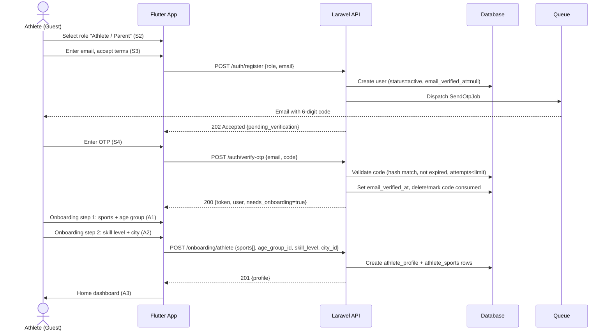
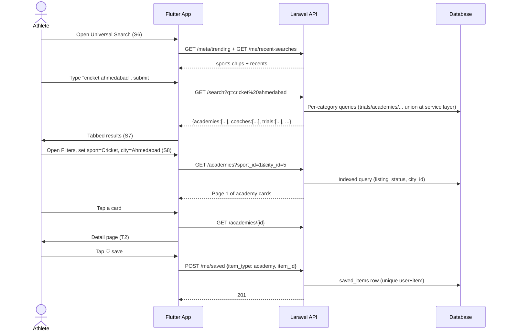
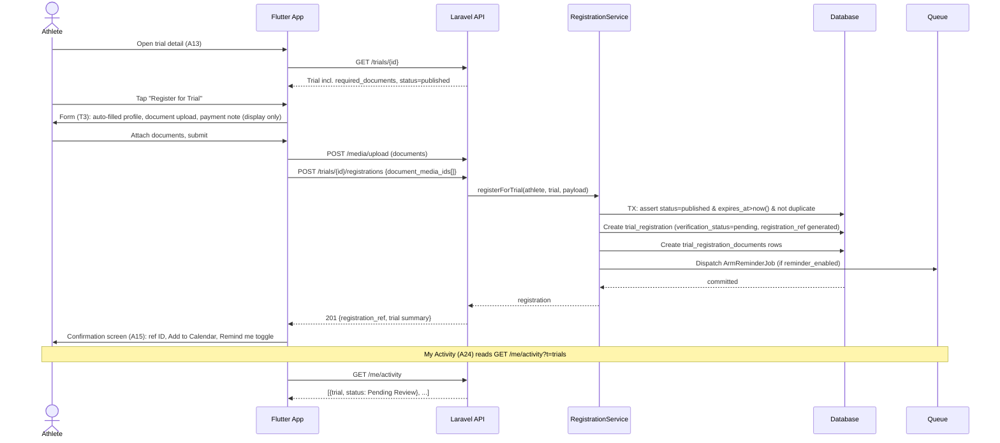
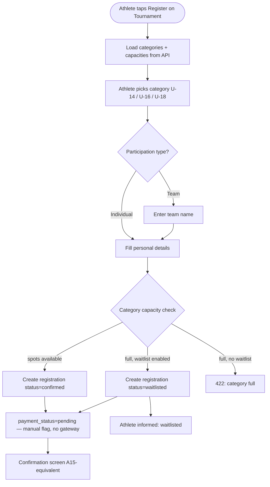
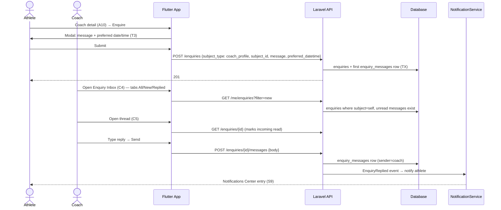
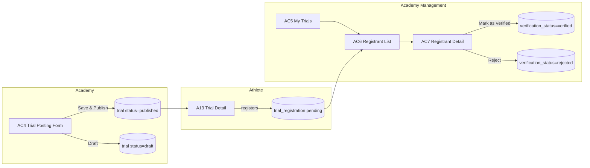
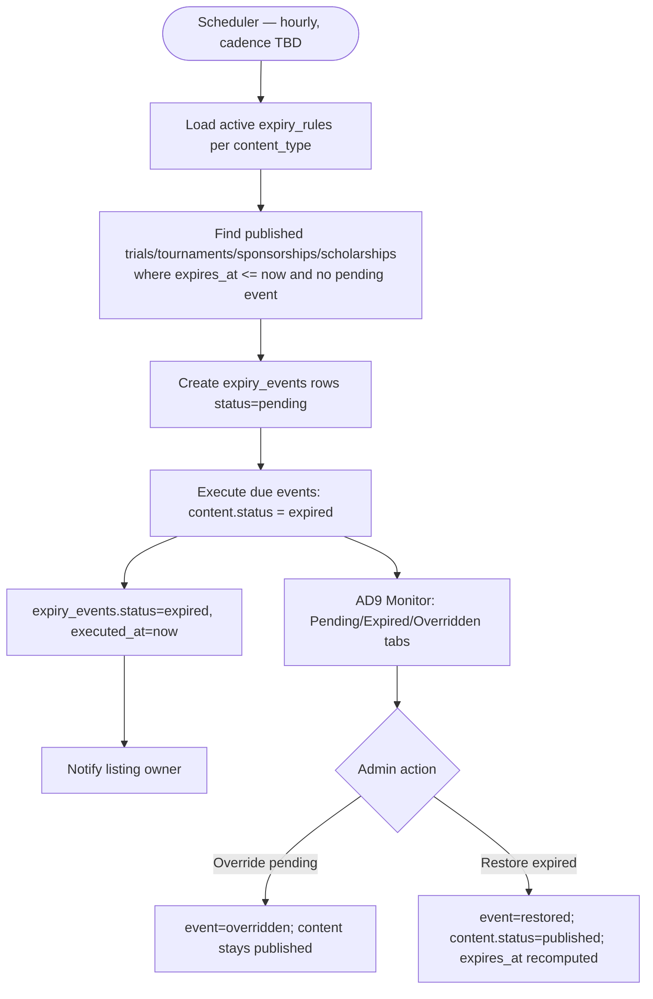
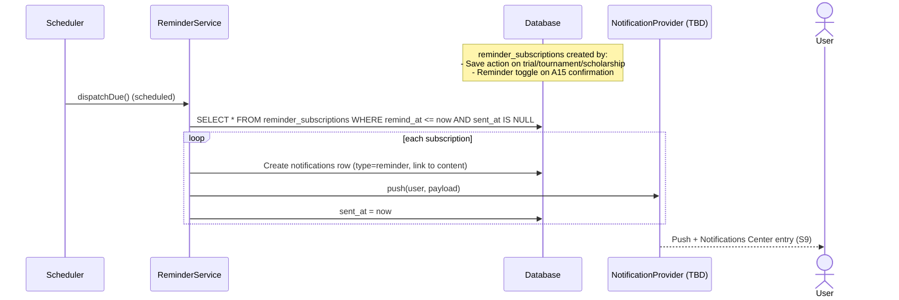

# System Flow — SportX India

End-to-end flows for the core user journeys. Sequence diagrams show actor ↔ Flutter app ↔ Laravel API ↔ DB/queue interactions; activity diagrams cover branching logic. All flows trace to screens in `SportX-India-Wireframes.md` and use cases in `Use-Cases.md`.

---

## 1. Auth & Onboarding

### 1.1 Sign-Up with Email OTP (S2 → S3 → S4 → A1/A2 → A3)



**Alternate paths**
- Wrong/expired OTP → `POST /auth/resend-otp` re-issues (resend timer honored client-side per S4).
- "Continue with Google" bypasses OTP; account verified at OAuth; `needs_onboarding=true` if no role profile exists yet.
- Phone entered at sign-up → stored unverified; verification deferred (decision).

### 1.2 Provider Onboarding (AC1 / C1 / O1 / SP1)

```mermaid
sequenceDiagram
    actor P as Provider (Coach/Academy/Organizer/Sponsor)
    participant F as Flutter App
    participant API as Laravel API
    participant DB as Database
    participant OBJ as Object Storage

    Note over P,OBJ: Post OTP-verify; role screens C1/AC1/O1/SP1
    P->>F: Complete role onboarding form
    alt Organizer or Sponsor
        P->>F: Upload verification document(s)
        F->>API: POST /media/upload (multipart)
        API->>OBJ: Store file (disk=s3)
        API->>DB: media_items row (owner=profile placeholder)
    end
    F->>API: POST /onboarding/{coach|academy|organizer|sponsor}
    API->>DB: Create role profile (listing_status=draft; verification_status=pending)
    API-->>F: 201 {profile}
    F->>P: Role dashboard (C3/AC3/O2/SP2)
```

---

## 2. Discovery Journey (search → filter → detail → save)



---

## 3. Trial Registration (A12 → A13 → A14 → A15 → A24)



**Business rules enforced in service:**
- Double registration blocked by unique `(trial_id, athlete_id)` → 409.
- `status != published` or `expires_at` passed → 422 "registration closed".
- `required_documents` list drives which document rows must exist before `document_status=submitted`.

---

## 4. Tournament Registration with Capacity & Waitlist (A16–A18 + O8)



**Organizer side (O7/O8):** `RegistrationManagement` list counts `confirmed` rows per category vs `tournament_categories.capacity`; organizer flips `payment_status` manually (`pending ↔ paid`) and edits `capacity`/`waitlist_enabled`.

---

## 5. Enquiry Flow (Athlete ↔ Coach/Academy) — A11 + C4/C5/AC8/AC9



> Sponsor flows (SP8 Reply, SP6 Message) reuse the same `enquiries`/`enquiry_messages` infrastructure with `subject_type = sponsorship_application` — see AS-04.

---

## 6. Sponsorship Application & Shortlist (A21–A23 + SP2–SP9)

```mermaid
sequenceDiagram
    actor A as Athlete
    actor S as Sponsor
    participant F as Flutter App
    participant API as Laravel API
    participant DB as Database

    A->>F: Sponsorship detail (A22) → Apply
    F->>A: Pitch form: note + profile auto-attach confirmed (T3)
    A->>F: Submit
    F->>API: POST /sponsorships/{id}/applications {pitch_note}
    API->>DB: sponsorship_applications (status=submitted; unique per sponsorship+athlete)
    API-->>F: 201 → visible in My Activity (A24, Sponsorships tab)

    S->>F: Dashboard (SP2) → Applications inbox (SP7)
    F->>API: GET /me/applications
    S->>F: Open application (SP8)
    F->>API: GET /applications/{id}
    alt Shortlist
        S->>F: Shortlist
        F->>API: POST /applications/{id}/shortlist
        API->>DB: application.status=shortlisted + upsert shortlist_entries
    else Reject
        S->>F: Reject
        F->>API: POST /applications/{id}/reject
        API->>DB: application.status=rejected
    else Reply
        S->>F: Reply → opens enquiry thread on this application
        F->>API: POST /applications/{id}/reply {message}
        API->>DB: enquiries(subject_type=sponsorship_application) + message
    end

    S->>F: Shortlist screen (SP9) — grouped list + per-athlete note
    F->>API: PUT /me/shortlist/{entry} {note}
```

---

## 7. Trial Posting & Registrant Management (Academy: AC4 → AC7)



**Document review sequence (AC7):**

```mermaid
sequenceDiagram
    actor Ac as Academy Owner
    participant API as Laravel API
    participant DB as Database
    participant OBJ as Storage

    Ac->>API: GET /trials/{id}/registrants
    API-->>Ac: list with document_status badges
    Ac->>API: GET /registrations/{id}
    API-->>Ac: athlete snapshot + document list
    Ac->>API: GET /media/{media_id}/url
    API->>OBJ: Generate signed URL
    OBJ-->>Ac: Render document in viewer
    Ac->>API: POST /registrations/{id}/verify  (or /reject)
    API->>DB: trial_registrations.verification_status = verified|rejected
    API-->>Ac: 200; athlete sees status update in My Activity
```

---

## 8. Results Publishing (O9 → O10)

```mermaid
sequenceDiagram
    actor O as Organizer
    actor Pub as Public Viewer
    participant F as Flutter App
    participant API as Laravel API
    participant DB as Database

    O->>F: Tournament → Publish Results (O9)
    O->>F: Select category; enter winner / runner-up / 3rd place
    O->>F: Upload bracket image (optional)
    F->>API: POST /tournaments/{id}/results {category_id, places[{place, winner_name}], bracket_media_id}
    API->>DB: Delete existing unpublished rows for category; insert tournament_results (place 1..3), published_at=now()
    API-->>O: 201

    Pub->>API: GET /tournaments/{id}/results
    API->>DB: tournament_results where published_at not null + bracket media URL
    API-->>Pub: Grouped by category → bracket visualization / ranked list (O10)
```

---

## 9. Reporting & Moderation (S10 → AD6 → AD7)

```mermaid
sequenceDiagram
    actor U as User
    actor Ad as Admin
    participant API as Laravel API
    participant DB as Database
    participant N as NotificationService

    U->>API: POST /reports {reportable_type, reportable_id, reason, comment}
    API->>DB: listing_reports (status=pending)
    API-->>U: 201

    Ad->>API: GET /admin/moderation/queue
    API->>DB: reports pending, grouped by reportable (count, reason, first_reported_at)
    API-->>Ad: AD6 queue rows

    Ad->>API: GET /admin/moderation/reports/{id}
    API-->>Ad: report detail + listing snapshot

    alt Approve (no action)
        Ad->>API: POST /admin/moderation/reports/{id}/approve
        API->>DB: report.status=approved, resolved_by, resolved_at
    else Edit listing
        Ad->>API: POST /admin/moderation/reports/{id}/edit-then-resolve
        API->>DB: opens content edit (AD5); report.status=edited
    else Remove listing
        Ad->>API: POST /admin/moderation/reports/{id}/remove
        API->>DB: listing.status=removed; report.status=removed
        API->>N: notify listing owner
    else Warn owner
        Ad->>API: POST /admin/moderation/reports/{id}/warn
        API->>DB: report.status=warned
        API->>N: notify listing owner
    end
```

---

## 10. Auto-Expiry Engine (AD8/AD9 + scheduler)



*Note:* `expires_at` is set when a listing is published (rule applied at publish time) and recomputed on restore. The sweep is idempotent via the pending-event guard.

---

## 11. Reminder Delivery



*Reminder offset (how many days/hours before the date to remind) is unspecified in sources — **AS-05**; default candidate: T-2 days and T-1 day per S9 example copy ("in 2 days", "tomorrow").*
