# Use Cases — SportX India

Actors and use case descriptions derived from the MVP Overview, Screen Inventory, and Wireframes. Includes a Mermaid use case diagram.

---

## 1. Actors

| Actor | Type | Description |
|---|---|---|
| **Guest** | Primary | Unauthenticated visitor. Can select a role, sign up, log in. |
| **Athlete / Parent** | Primary | The primary consumer. Browses, searches, saves, registers, applies, reports. (A parent may operate the account on behalf of a minor athlete.) |
| **Coach** | Primary | Service provider with a public listing, enquiry inbox; can also browse like an athlete. |
| **Academy** | Primary | Organization with a public listing; posts trials, manages registrants, answers enquiries. |
| **Organizer** | Primary | Runs standalone trials/tournaments; manages registrations, capacity, results. |
| **Sponsor / Brand** | Primary | Posts sponsorships, discovers athletes, reviews applications, shortlists. |
| **Admin** | Secondary (internal) | Platform team: seeds/corrects data, moderates reports, configures expiry, manages master categories. |
| **Scheduler / System** | System | Automated jobs: auto-expiry sweeps, reminder generation. *(Implementation detail surfaced as an actor for completeness.)* |

> Note: Coach/Academy/Organizer/Sponsor are collectively referred to as **"Providers"** below where their behavior is identical.

---

## 2. Use Case Diagram

```mermaid
flowchart LR
    subgraph Actors
        Guest([Guest])
        Athlete([Athlete / Parent])
        Coach([Coach])
        Academy([Academy])
        Organizer([Organizer])
        Sponsor([Sponsor / Brand])
        Admin([Admin])
        System([Scheduler / System])
    end

    subgraph SportX["SportX India Platform"]
        direction TB

        subgraph Auth["Authentication"]
            UC1(Sign Up)
            UC2(Verify Email via OTP)
            UC3(Log In / Log Out)
            UC4(Role selection)
            UC5(Role onboarding)
            UC1x(Sign in with Google)
        end

        subgraph Profile["Profiles & Listings"]
            UC6(Manage athlete profile & media gallery)
            UC7(Manage coach listing)
            UC8(Manage academy listing)
        end

        subgraph Discovery["Discovery"]
            UC9(Universal search)
            UC10(Apply global filters)
            UC11(Browse directories & feeds)
            UC12(View listing detail)
            UC13(Save / bookmark listings)
            UC14(Report a listing)
        end

        subgraph Actions["Athlete Actions"]
            UC15(Enquire with coach/academy)
            UC16(Register for trial)
            UC17(Register for tournament)
            UC18(View scholarship & apply externally)
            UC19(Pitch to sponsorship)
            UC20(Track activity)
            UC21(Toggle reminders / view notifications)
        end

        subgraph ProviderMgmt["Provider Management"]
            UC22(Manage enquiry inbox & reply)
            UC23(Post/edit/publish/close trials)
            UC24(Post/edit/publish tournaments)
            UC25(View & manage registrants)
            UC26(Verify/reject registrant documents)
            UC27(Manage capacity & waitlist)
            UC28(Publish results)
            UC29(Manage sponsorship listings)
            UC30(Discover athletes)
            UC31(Review applications)
            UC32(Shortlist athletes with notes)
        end

        subgraph AdminMgmt["Administration"]
            UC33(Admin login with 2FA)
            UC34(Content CRUD across categories)
            UC35(Moderate reported listings)
            UC36(Configure expiry rules)
            UC37(Monitor/override expirations)
            UC38(Manage sports/cities/age groups)
        end

        subgraph SystemJobs["Automated Jobs"]
            UC39(Auto-expire listings)
            UC40(Send deadline reminders)
        end
    end

    Guest --> UC4
    Guest --> UC1
    Guest --> UC3
    UC1 --> UC2
    UC1 -.extends.-> UC1x
    UC2 --> UC5

    Athlete --> UC6
    Athlete --> UC9
    Athlete --> UC10
    Athlete --> UC11
    Athlete --> UC12
    Athlete --> UC13
    Athlete --> UC14
    Athlete --> UC15
    Athlete --> UC16
    Athlete --> UC17
    Athlete --> UC18
    Athlete --> UC19
    Athlete --> UC20
    Athlete --> UC21

    Coach --> UC7
    Coach --> UC22
    Coach -.browse like any user.-> UC11

    Academy --> UC8
    Academy --> UC22
    Academy --> UC23
    Academy --> UC25
    Academy --> UC26

    Organizer --> UC23
    Organizer --> UC24
    Organizer --> UC25
    Organizer --> UC27
    Organizer --> UC28

    Sponsor --> UC29
    Sponsor --> UC30
    Sponsor --> UC31
    Sponsor --> UC32

    Admin --> UC33
    Admin --> UC34
    Admin --> UC35
    Admin --> UC36
    Admin --> UC37
    Admin --> UC38

    System --> UC39
    System --> UC40
    UC39 -.configured by.-> UC36
    UC40 --> UC21
```

*Rendered with `flowchart` for maximum Mermaid renderer compatibility; semantics follow standard UML use case relationships.*

---

## 3. Use Case Descriptions

### UC1 — Sign Up

| | |
|---|---|
| **Actor** | Guest |
| **Precondition** | User has selected a role (UC4) |
| **Main flow** | 1. System shows phone/email input with terms checkbox and Google option (S3). 2. User enters email *(primary per decision)* or phone, accepts terms, taps Continue. 3. System creates an unverified account and sends a 6-digit code. 4. User proceeds to UC2. |
| **Alternate** | 1a. "Continue with Google" → OAuth flow creates/links a verified account, skipping UC2. 2a. Terms not accepted → Continue disabled. |
| **Postcondition** | Verified account exists with the chosen role |

### UC2 — Verify Email via OTP

| | |
|---|---|
| **Actor** | Guest |
| **Main flow** | 1. System shows 6-digit code entry with masked destination and resend timer (S4). 2. User enters code. 3. System validates → marks account verified → routes to role onboarding (UC5). |
| **Alternate** | Code wrong/expired → error; resend available after timer. |

### UC5 — Role Onboarding

| | |
|---|---|
| **Actor** | Newly registered user (any role) |
| **Main flow** | Per role: Athlete → sport(s) + age group, then skill level + city (A1/A2). Coach → sport(s), certifications, experience (C1). Academy → name, sport(s), city (AC1). Organizer → org name, type, verification docs (O1). Sponsor → brand name, logo, category, verification docs (SP1). |
| **Postcondition** | Role profile exists; user lands on role dashboard/home |

### UC6 — Manage Athlete Profile & Media Gallery

| | |
|---|---|
| **Actor** | Athlete / Parent |
| **Main flow** | View profile (A4) → Edit (A5): change name, sport(s), age group, skill level, city; add/remove achievements; manage media gallery (A6): upload photos/videos, delete, drag-to-reorder. |
| **Postcondition** | Updated profile is publicly viewable (incl. to sponsors) |

### UC9 — Universal Search

| | |
|---|---|
| **Actor** | Athlete / Parent (also Coach browsing) |
| **Main flow** | 1. Open search (S6): recent searches + trending chips. 2. Enter query. 3. System returns unified results with category tabs (S7). 4. User switches tabs, loads more, opens a result (UC12). |
| **Extensions** | UC10 (filters) applies to any tab. |

### UC10 — Apply Global Filters

| | |
|---|---|
| **Actor** | Athlete / Parent |
| **Main flow** | Open filter panel (S8) → set sport(s), city/state, age group, price range, date range → Apply. Results refresh. Clear resets. |

### UC14 — Report a Listing

| | |
|---|---|
| **Actor** | Athlete / Parent (any signed-in user — assumption) |
| **Main flow** | 1. From detail page, choose "Report this listing". 2. Modal (S10): select reason (Fake/Scam, Outdated, Inappropriate, Other) + optional comment → Submit. 3. System records the report and aggregates count for the moderation queue. |
| **Postcondition** | Report visible to admins (UC35) |

### UC15 — Enquire with Coach/Academy

| | |
|---|---|
| **Actor** | Athlete / Parent |
| **Main flow** | From Coach/Academy detail → Enquire → form with message + preferred date/time (A11/T3) → Submit. Provider sees it in their enquiry inbox (UC22); athlete gets notified on reply (UC21). |

### UC16 — Register for a Trial

| | |
|---|---|
| **Actor** | Athlete / Parent |
| **Precondition** | Trial is published and not expired/closed |
| **Main flow** | 1. Trial detail (A13) → Register for Trial. 2. Form: auto-filled profile, personal details, document upload, payment note *(informational only — no payment processing)* (A14/T3). 3. Submit → confirmation screen with registration ID, add-to-calendar, reminder toggle (A15). 4. Registration appears in My Activity with status. |
| **Alternate** | Required documents missing → validation error. Trial full (organizer capacity, no waitlist) → registration blocked. |

### UC17 — Register for a Tournament

| | |
|---|---|
| **Actor** | Athlete / Parent |
| **Main flow** | Tournament calendar/detail (A16/A17) → Register → category selection + team/individual + details (A18) → confirmation as in UC16. Capacity enforced per category; waitlist offered if enabled (UC27). |

### UC18 — View Scholarship & Apply Externally

| | |
|---|---|
| **Actor** | Athlete / Parent |
| **Main flow** | Scholarship feed (A19) → detail (A20) with eligibility, application steps → "Apply" opens external provider link. Application state is **not** tracked in-app. |

### UC19 — Pitch to Sponsorship

| | |
|---|---|
| **Actor** | Athlete / Parent |
| **Main flow** | Sponsorship detail (A22) → Apply/Pitch (A23): pitch note + auto-attached profile → Submit. Status tracked in My Activity; sponsor reviews via UC31. |

### UC20 — Track Activity

| | |
|---|---|
| **Actor** | Athlete / Parent |
| **Main flow** | My Activity (A24) → tabs Trials / Tournaments / Sponsorships → per-item status (e.g. Confirmed, Pending Review). |

### UC22 — Manage Enquiry Inbox & Reply

| | |
|---|---|
| **Actor** | Coach, Academy |
| **Main flow** | Inbox list with All/New/Replied tabs (T4) → open thread (T4b) → type reply → Send. Athlete receives notification. |

### UC23 — Post/Edit/Publish/Close Trials

| | |
|---|---|
| **Actor** | Academy (own name) or Organizer |
| **Main flow** | Create form (AC4): name, sport, date/time, venue, eligibility, entry fee, required documents, contact → save as Draft or Publish. Management list (T1) → edit or close. Closed/expired trials stop accepting registrations. |

### UC24 — Post/Edit/Publish Tournaments

| | |
|---|---|
| **Actor** | Organizer |
| **Main flow** | Form (O5): name, format, dates, venue, entry fee, prize pool, categories → Save & Publish. Managed via list (O6). |

### UC25/UC26 — View Registrants; Verify/Reject Documents

| | |
|---|---|
| **Actor** | Academy (trials under its name), Organizer (its events) |
| **Main flow** | Registrant list (AC6/O7) with document status, counts, and (organizer) manual payment-status flag → open registrant detail (AC7): profile snapshot, document viewer → **Mark as Verified** or **Reject**. |

### UC27 — Manage Capacity & Waitlist

| | |
|---|---|
| **Actor** | Organizer |
| **Main flow** | Capacity screen (O8): adjust spots per category, view filled counts, toggle waitlist when full → Save. Affects UC16/UC17 availability. |

### UC28 — Publish Results

| | |
|---|---|
| **Actor** | Organizer |
| **Main flow** | Results form (O9): select category → set winner/runner-up/3rd place → optional bracket image → Publish. Public results view (O10) shows bracket/placements. |

### UC30 — Discover Athletes

| | |
|---|---|
| **Actor** | Sponsor / Brand |
| **Main flow** | Athlete discovery search (SP5) with filters (sport, age, city, level) → athlete cards → profile view (SP6) → Shortlist or Message. |

### UC31/UC32 — Review Applications; Shortlist

| | |
|---|---|
| **Actor** | Sponsor / Brand |
| **Main flow** | Applications inbox (SP7) → application detail (SP8): pitch note, full profile link → **Shortlist / Reject / Reply**. Shortlist (SP9) shows grouped athletes with editable notes. |

### UC33 — Admin Login

| | |
|---|---|
| **Actor** | Admin |
| **Main flow** | Admin portal (AD1): email + password + 2FA code → dashboard (AD2) with counters. |

### UC34 — Content CRUD

| | |
|---|---|
| **Actor** | Admin |
| **Main flow** | Category picker with counts (AD3) → content list with search/sort/filter (AD4) → create/edit via dynamic form matching owner schema (AD5) → Save or Delete. Also the source of all scholarship records (FR-ADMIN-11). |

### UC35 — Moderate Reported Listings

| | |
|---|---|
| **Actor** | Admin |
| **Main flow** | Reported listings queue (AD6): listing, reason, report count, age → Review (AD7): full report detail + view listing → choose action: **Approve (no action) / Edit Listing / Remove Listing / Warn Owner**. Action recorded for audit. |

### UC36/UC37 — Configure Expiry Rules; Monitor & Override

| | |
|---|---|
| **Actor** | Admin (configure/monitor); Scheduler (execute) |
| **Main flow** | Expiry rules screen (AD8): per type, set auto-expiry timing (e.g. trials = N days after event date) → Save. Expiry monitor (AD9): tabs Pending/Expired/Overridden → **Override** a pending expiration or **Restore** an expired listing Add commentMore actions |

### UC39 — Auto-Expire Listings (System)

| | |
|---|---|
| **Actor** | Scheduler / System |
| **Trigger** | Scheduled sweep |
| **Main flow** | Evaluate published time-boxed listings against configured rules → mark expired → surface in Expiry Monitor. Restorable by admin. |

### UC40 — Send Deadline Reminders (System)

| | |
|---|---|
| **Actor** | Scheduler / System |
| **Trigger** | Approaching dates |
| **Main flow** | For users with saved trials/tournaments/scholarships (or explicit reminder toggles from confirmations), generate reminder notifications as dates approach → deliver to Notifications Center (S9) and push channel *(provider TBD)*. |

### UC41 — Browse Sports Venues (Athlete/Any)

| | |
|---|---|
| **Actor** | Any authenticated user |
| **Trigger** | Tap "Sports Venues" from Home (A3), Search results (S7), or filter by category |
| **Main flow** | Load sports venues list (T1) filtered by sport/city → tap venue → view detail (T2) with address, Google Maps link, contact, facilities, working hours, pricing, booking availability → save/report |
| **Source** | AS-47 (Mandatory Fields PDF) |
